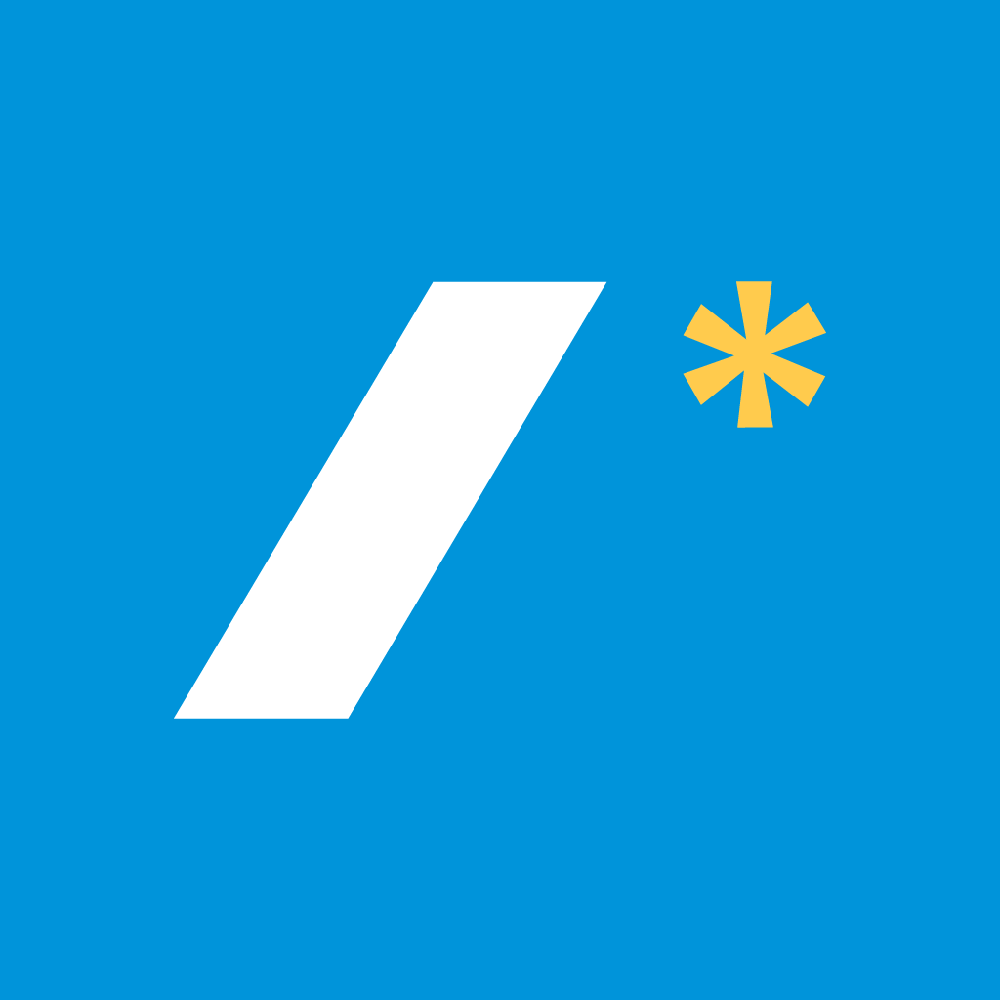
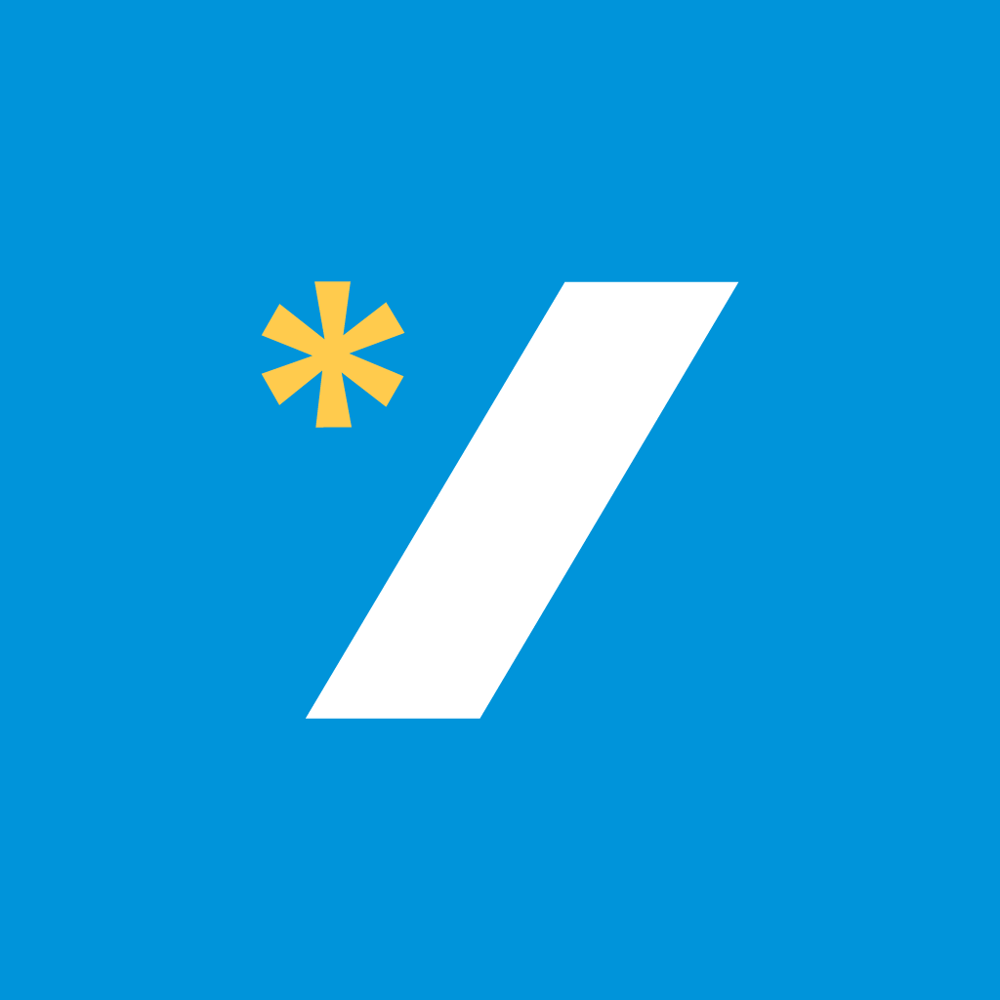
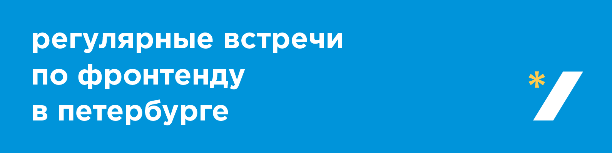
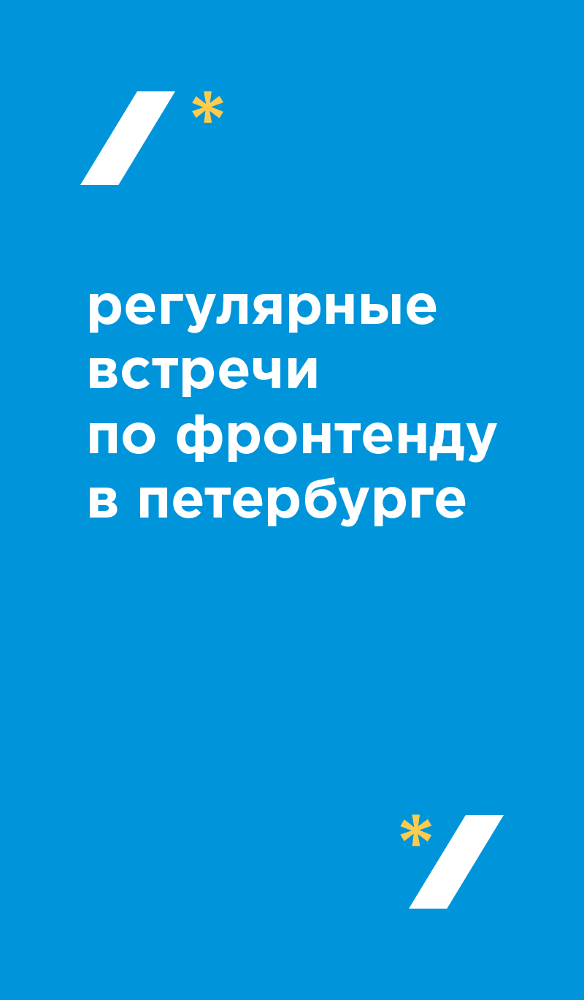
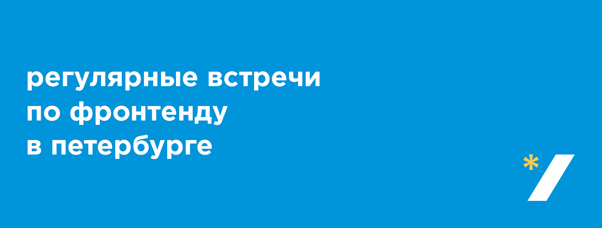
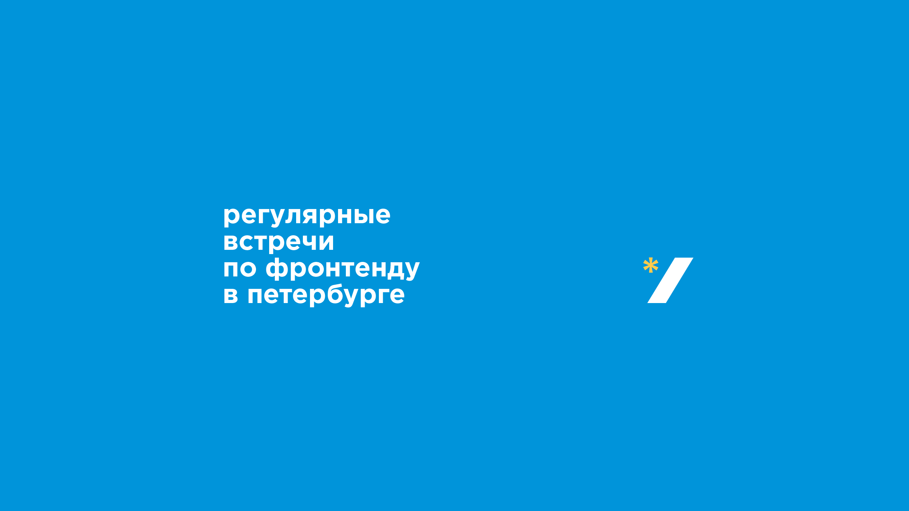
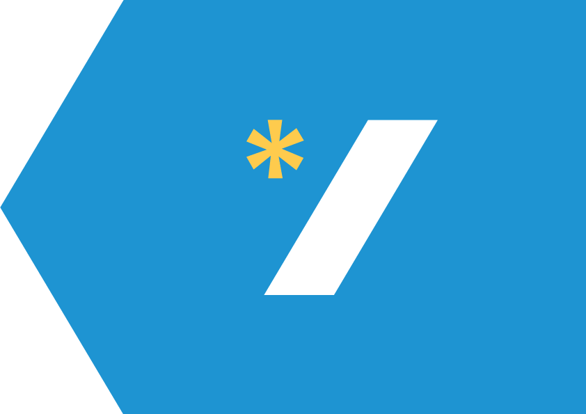
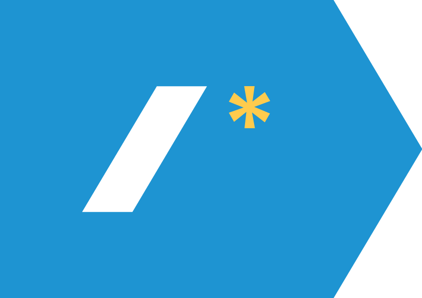

# Стиль для pitercss_meetup

[Шрифт Gotham Pro](https://github.com/Seafnox/Gothampro).

## Цвета

- Синий: `#0094da`
- Жёлтый: `#ffcb4d`

## Логотип

Открывающий: [SVG](logo/open.svg) или [PNG](logo/open.png) (1024 × 1024)

Закрывающий: [SVG](logo/close.svg) или [PNG](logo/close.png) (1024 × 1024)

[Исходник](logo/logo.ai) (RGB) и [наклейки](logo/logo.ai) (CMYK) в AI

## Страницы

Верхний баннер для Вконтакте: [PNG](pages/vk-top.png) или [PSD](pages/vk-top.psd)

Правый баннер для Вконтакте: [PNG](pages/vk-right.png) или [PSD](pages/vk-right.psd)

Баннер для Фейсбука: [PNG](pages/facebook.png) или [PSD](pages/facebook.psd)

Баннер для Ютуба: [PNG](pages/youtube.png) или [PSD](pages/youtube.psd)

## События

- Анонс митапа в соцсетях: [PSD](events/social.psd)
- Обложка митапа для видео: [PSD](events/social.psd)
- Фоновая картинка для десктопа: [PSD](events/desktop.psd)
- Анонс доклада в соцсетях: [PSD](events/talk-social.psd)
- Обложка доклада для видео: [PSD](events/talk-video.psd)
- Шаблон для фотографии: [PSD](events/photo.psd)

## Стрелки

Стрелки для указателей: [PDF](arrows/arrows.pdf) или [AI](arrows/arrows.ai) (CMYK)

---

[Разработано в Шишках](http://www.shishki.pro/)
